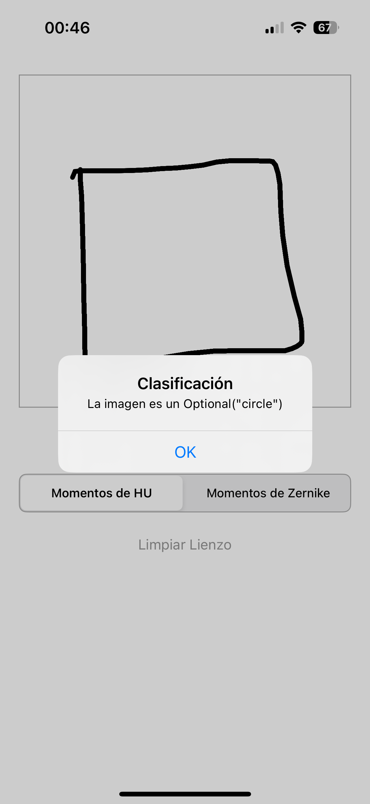

## Aplicación Móvil Swift

Esta aplicación móvil permite al usuario dibujar figuras geométricas en un lienzo interactivo y clasificar automáticamente la figura dibujada como círculo, cuadrado o triángulo, utilizando momentos invariantes de Hu o momentos de Zernike. El modelo de clasificación se basa en datos de referencia almacenados en un archivo CSV.

### **Introducción**
En este proyecto, se desarrolla una aplicación móvil en **Swift** que permite capturar imágenes dibujadas por el usuario y analizar su contenido mediante la extracción de **momentos de Hu** y **momentos de Zernike**. Estos momentos son utilizados como descriptores de forma para clasificar los dibujos en diferentes categorías predefinidas.

### **Fundamentos Teóricos**
#### **Momentos de Hu**
Los momentos de Hu son un conjunto de **siete invariantes geométricos** derivados de los momentos centrales de una imagen. Fueron introducidos por Ming-Kuei Hu en 1962 y se utilizan para representar la forma de los objetos en imágenes digitales de manera **invariante a traslación, escala y rotación**.

Los siete momentos de Hu están diseñados para capturar propiedades esenciales de la forma, permitiendo el reconocimiento de patrones sin importar la orientación o tamaño de la imagen.

- **Invariantes a transformaciones geométricas**: La forma puede ser reconocida sin importar su posición, tamaño u orientación.  
- **Fáciles de calcular**: Se basan en momentos estadísticos de la imagen.  
- **Se utilizan ampliamente en reconocimiento de patrones y visión por computadora**.  

#### **Momentos de Zernike**
Los momentos de Zernike son descriptores basados en **polinomios ortogonales definidos en un disco unitario**. Se utilizan en el análisis de imágenes porque son **invariantes a traslación, rotación y escala**, al igual que los momentos de Hu, pero ofrecen una representación más compacta y descriptiva.

- **Ortogonalidad**: Los polinomios de Zernike son ortogonales dentro de un disco unitario, evitando redundancias en la información extraída.  
- **Mayor precisión**: Permiten reconstrucciones de formas con menos coeficientes en comparación con los momentos de Hu.  
- **Se utilizan en aplicaciones de reconocimiento de patrones y visión artificial**.  

### Flujo

1.	El usuario dibuja una figura geométrica (círculo, cuadrado o triángulo) en el lienzo.
2.	Al presionar el botón “Capturar”, la aplicación convierte el dibujo a una imagen y la procesa.
3.	Dependiendo de la opción seleccionada (momentos de Hu o momentos de Zernike), se calculan los momentos correspondientes.
4.	Se compara la imagen con los datos de referencia almacenados en el CSV utilizando la distancia euclidiana.
5.	Se muestra el resultado de la clasificación en una alerta emergente.

### Estructura del Proyecto
* `ViewController.swift`: Controlador principal de la interfaz de usuario. Aquí se gestiona la captura del dibujo y la llamada al procesamiento de la imagen.
* `ZernikeBridge.h` y `ZernikeBridge.mm`: Implementación del puente entre Swift y C++ para calcular los momentos de Zernike y realizar la clasificación.
* `ImageProcessor.h` y `ImageProcessor.mm`: Implementación del procesamiento de imágenes en C++ para calcular los momentos de Hu y la clasificación correspondiente.
* `DrawingCanvasView.swift`: Clase que gestiona el lienzo interactivo donde el usuario puede dibujar.

### Cómo Funciona la Clasificación
1. Se convierte la imagen capturada del lienzo (UIImage) a una matriz OpenCV (cv::Mat).
2. Se aplica preprocesamiento a la imagen (escalado a grises y umbralización).
3. Se calculan los momentos invariantes:
* Momentos de Hu: Se utilizan 7 valores invariantes para la clasificación.
* Momentos de Zernike: Se calcula el orden deseado y se obtiene un vector de características.
4. Se compara el vector de momentos con los datos de referencia del archivo CSV usando la distancia euclidiana.
5. La categoría con la menor distancia es la predicción final.

### Ejemplos funcionamiento

